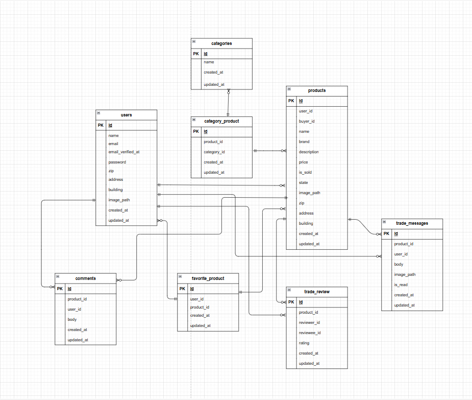

# 「coachtechフリマ」

本アプリはCOACHTECHのテスト課題としてLaravel 8で開発したフリマアプリです。  10～30代の社会人をターゲットとし、PCでの使用を想定して開発しました。

## 🚀 実装済み機能一覧

#### ■　基盤・ユーザー機能
- 会員登録・ログイン (Fortify)
- メール認証 (Mailhog対応)
- プロフィール編集（画像・住所など）
- プロフィール画像アップロード
- バリデーション　（formRequest）
- テストコード

#### ■　商品機能
- 商品出品（画像アップロード・複数カテゴリ対応）
- 商品一覧・詳細ページ
- 商品検索
- いいね機能
- コメント投稿
- Stripeによる購入機能
- 配送先住所変更
- マイリスト表示

#### ■　マイページ
- 出品一覧 / 購入一覧 / 取引中一覧
- 取引中商品の未読メッセージ数バッジ表示
- プロフィール画面に「平均評価」を表示
　→評価がない場合は非表示
　→小数点以下は四捨五入 

### ■　★追加実装
#### 🔥 取引チャット機能
- 出品者・購入者のみアクセス可能
- テキスト/画像メッセージ投稿

#### 🔥 メッセージ編集・削除機能
- 自分が投稿したメッセージのみ編集/削除可能
- バリデーション（formRequest）

#### 🔥 未読メッセージのカウント
- 取引相手のメッセージのみ「未読」として扱う
- タブ横に未読件数を表示
- 商品ごとのバッジ表示アリ

#### 🔥 評価機能
-　取引終了後に相互評価
- ユーザーの平均評価を表示

## 🐳 dockerビルド手順

1. リポジトリのクローン

    `git clone https://github.com/tomo1583gh/coachtech-flea-market-d.git`

2. 階層を変更
　　`cd coachtech-flea-market-d`

3. Dockerコンテナのビルド・起動

    `docker-compose up -d --build`

    ※  MySQLは、OSによって起動しない場合があるのでそれぞれのPCに合わせてdocker-compose.ymlファイルを編集して下さい。

## 🛠️ laravel　環境構築

1. PHPコンテナに入る

    `docker-compose exec php bash`

2. Composerで依存パッケージをインストール

    `composer install`

3. .envファイルを作成

    `cp .env.example .env`

    必要に応じて環境変数を編集

4. アプリケーションキーを生成

    `php artisan key:generate`

5. マイグレーションを実行

    `php artisan migrate`

6. 初期データを投入

    `php artisan db:seed`

7. シンボリックリンクの作成

    `php artisan storage:link`

8. Mailhog起動（別途インストール必要）

    http://localhost:8025 にアクセスし、送信メールを確認出来ます  
    `.env`のMAIL_HOST=mailhogを設定してください

9. Stripeの公開鍵と秘密鍵を`.env`に設定

## 🛠️ 使用技術

- php 8.2.12

- laravel 8.83.29

- MySQL 8.0.26

- Fortify【認証機能】

- Mailhog【メール確認】

- Stripe【支払い処理】

- Blade + CSS

## 🔗URL

- 開発環境：http://localhost:8000

- phpMyAdmin:http://localhost:8080

- Mailhog:http://localhost:8025

- Stripe:https://dashboard.stripe.com/test

## 📌ER図

## 🗂️ ダミーデータ（Seeder）について

本アプリではテスト動作確認のため、以下のデータが自動生成されます。

#### ■　ユーザー（3名）
| No | 名前        | メールアドレス                                           | 役割                |
| -- | --------- | ------------------------------------------------- | ----------------- |
| 1  | seller1   | [seller1@example.com](mailto:seller1@example.com) | 商品 C001〜C005 の出品者 |
| 2  | seller2   | [seller2@example.com](mailto:seller2@example.com) | 商品 C006〜C010 の出品者 |
| 3  | test-user | [test@example.com](mailto:test@example.com)       | 購入・チャット確認用        |

すべてのパスワードは　：　password

#### ■　商品データ　CO01～CO10

| 商品ID      | 商品名                                      | 価格 | 出品者     |
| --------- | ---------------------------------------- | -- | ------- |
| C001〜C005 | 腕時計 / HDD / 玉ねぎ3束 / 革靴 / ノートPC           | 各種 | seller1 |
| C006〜C010 | マイク / ショルダーバッグ / タンブラー / コーヒーミル / メイクセット | 各種 | seller2 |

